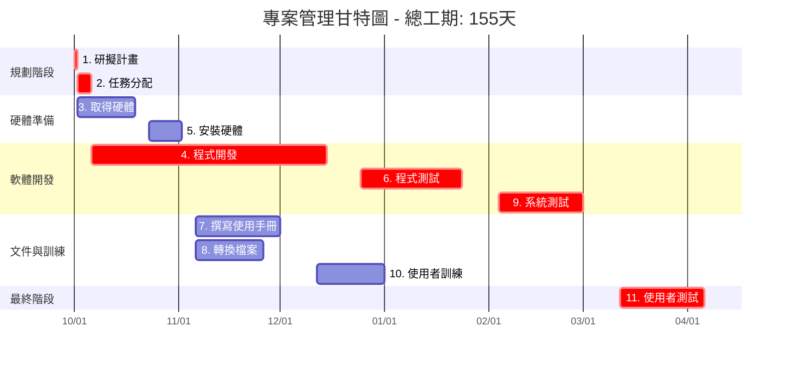
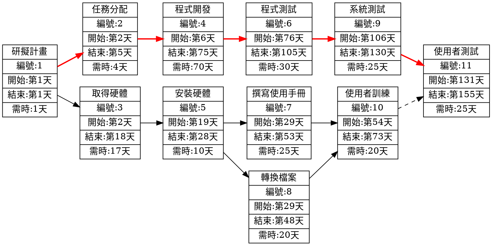

```mermaid
gantt
    title 專案管理甘特圖 - 總工期: 155天
    dateFormat YYYY-MM-DD
    axisFormat %m/%d
    
    section 規劃階段
    1. 研擬計畫     :crit, 2024-10-01, 1d
    2. 任務分配     :crit, 2024-10-02, 4d
    
    section 硬體準備
    3. 取得硬體     :2024-10-02, 17d
    5. 安裝硬體     :2024-10-23, 10d
    
    section 軟體開發
    4. 程式開發     :crit, 2024-10-06, 70d
    6. 程式測試     :crit, 2024-12-25, 30d
    9. 系統測試     :crit, 2025-02-04, 25d
    
    section 文件與訓練
    7. 撰寫使用手冊  :2024-11-06, 25d
    8. 轉換檔案     :2024-11-06, 20d
    10. 使用者訓練  :2024-12-12, 20d
    
    section 最終階段
    11. 使用者測試  :crit, 2025-03-12, 25d
```

```graphviz
digraph {
    node[shape=record];
    rankdir="LR";
    
    no1 [label = "研擬計畫 | 編號:1 | 開始:第1天 | 結束:第1天 | 需時:1天"]
    no2 [label = "任務分配 | 編號:2 | 開始:第2天 | 結束:第5天 | 需時:4天"]
    no3 [label = "取得硬體 | 編號:3 | 開始:第2天 | 結束:第18天 | 需時:17天"]
    no4 [label = "程式開發 | 編號:4 | 開始:第6天 | 結束:第75天 | 需時:70天"]
    no5 [label = "安裝硬體 | 編號:5 | 開始:第19天 | 結束:第28天 | 需時:10天"]
    no6 [label = "程式測試 | 編號:6 | 開始:第76天 | 結束:第105天 | 需時:30天"]
    no7 [label = "撰寫使用手冊 | 編號:7 | 開始:第29天 | 結束:第53天 | 需時:25天"]
    no8 [label = "轉換檔案 | 編號:8 | 開始:第29天 | 結束:第48天 | 需時:20天"]
    no9 [label = "系統測試 | 編號:9 | 開始:第106天 | 結束:第130天 | 需時:25天"]
    no10 [label = "使用者訓練 | 編號:10 | 開始:第54天 | 結束:第73天 | 需時:20天"]
    no11 [label = "使用者測試 | 編號:11 | 開始:第131天 | 結束:第155天 | 需時:25天"]
    
    // 關鍵路徑連接（紅色）
    no1->no2 [color="red", penwidth=2.0]
    no2->no4 [color="red", penwidth=2.0]
    no4->no6 [color="red", penwidth=2.0]
    no6->no9 [color="red", penwidth=2.0]
    no9->no11 [color="red", penwidth=2.0]
    
    // 非關鍵路徑連接（黑色）
    no1->no3
    no3->no5
    no5->no7
    no5->no8
    no7->no10
    no8->no10
    no10->no11 [style="dashed"] // 虛線表示非關鍵連接
}
```
