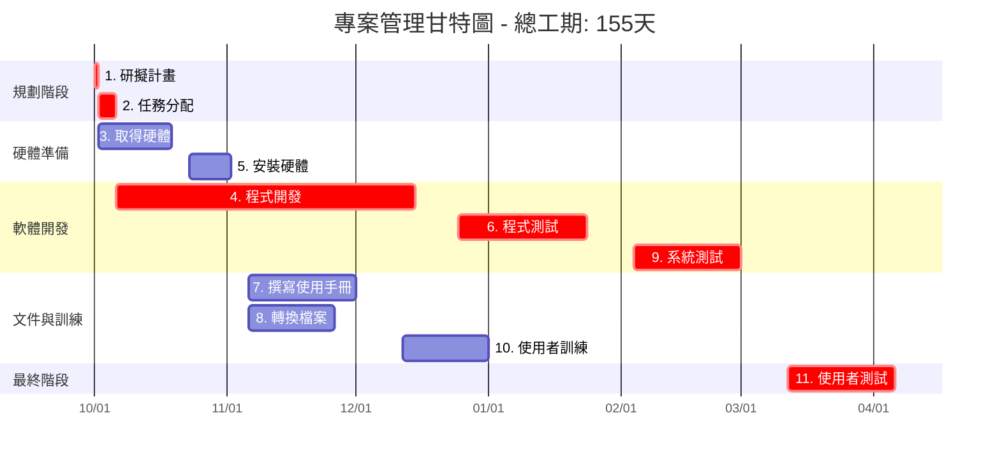
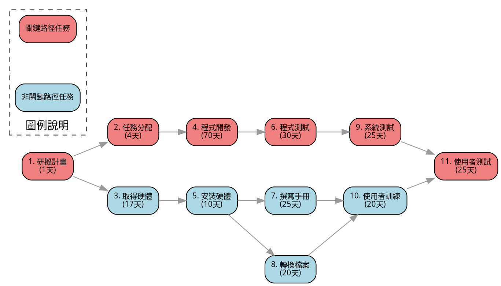

```mermaid
gantt
    title 專案管理甘特圖 - 總工期: 155天
    dateFormat YYYY-MM-DD
    axisFormat %m/%d
    
    section 規劃階段
    1. 研擬計畫     :crit, 2024-10-01, 1d
    2. 任務分配     :crit, 2024-10-02, 4d
    
    section 硬體準備
    3. 取得硬體     :2024-10-02, 17d
    5. 安裝硬體     :2024-10-23, 10d
    
    section 軟體開發
    4. 程式開發     :crit, 2024-10-06, 70d
    6. 程式測試     :crit, 2024-12-25, 30d
    9. 系統測試     :crit, 2025-02-04, 25d
    
    section 文件與訓練
    7. 撰寫使用手冊  :2024-11-06, 25d
    8. 轉換檔案     :2024-11-06, 20d
    10. 使用者訓練  :2024-12-12, 20d
    
    section 最終階段
    11. 使用者測試  :crit, 2025-03-12, 25d
```

```graphviz
digraph project_flow {

    nodesep=0.75
    rankdir=LR // 從左到右的方向
    
    node [fontname="Microsoft JhengHei", shape=box, style="rounded,filled", fontsize=10]
    edge [color=gray60]
    
    // 所有任務節點
    plan [label="1. 研擬計畫\n(1天)", fillcolor="lightcoral"]
    assign [label="2. 任務分配\n(4天)", fillcolor="lightcoral"]  
    hardware [label="3. 取得硬體\n(17天)", fillcolor="lightblue"]
    develop [label="4. 程式開發\n(70天)", fillcolor="lightcoral"]
    install [label="5. 安裝硬體\n(10天)", fillcolor="lightblue"]
    test [label="6. 程式測試\n(30天)", fillcolor="lightcoral"]
    manual [label="7. 撰寫手冊\n(25天)", fillcolor="lightblue"]
    convert [label="8. 轉換檔案\n(20天)", fillcolor="lightblue"]
    system [label="9. 系統測試\n(25天)", fillcolor="lightcoral"]
    training [label="10. 使用者訓練\n(20天)", fillcolor="lightblue"]
    final [label="11. 使用者測試\n(25天)", fillcolor="lightcoral"]
    
    // 連接關係
    plan->assign
    plan->hardware
    assign->develop
    hardware->install
    develop->test
    install->manual
    install->convert
    test->system
    manual->training
    convert->training
    system->final
    training->final
    
    // 圖例說明
    subgraph cluster_legend {
        label="圖例說明"
        labelloc=b
        style=dashed
        key_critical [label="關鍵路徑任務", fillcolor="lightcoral"]
        key_normal [label="非關鍵路徑任務", fillcolor="lightblue"]
    }
}
```
