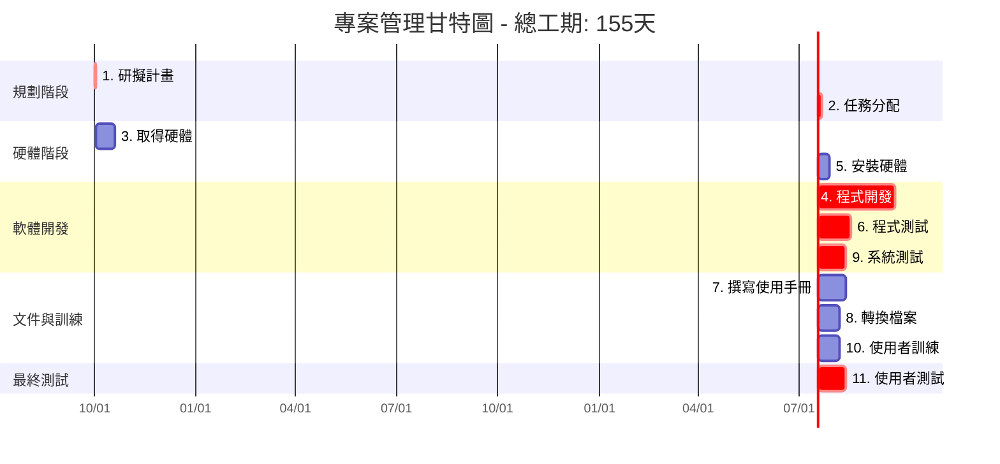

```mermaid
gantt
    title 專案管理甘特圖 - 總工期: 155天
    dateFormat YYYY-MM-DD
    axisFormat %m/%d
    
    section 規劃階段
    1. 研擬計畫     :crit, 2024-10-01, 1d
    2. 任務分配     :crit, after 1, 4d
    
    section 硬體階段
    3. 取得硬體     :2024-10-02, 17d
    5. 安裝硬體     :after 3, 10d
    
    section 軟體開發
    4. 程式開發     :crit, after 2, 70d
    6. 程式測試     :crit, after 4, 30d
    9. 系統測試     :crit, after 6, 25d
    
    section 文件與訓練
    7. 撰寫使用手冊  :after 5, 25d
    8. 轉換檔案     :after 5, 20d
    10. 使用者訓練  :after 7 8, 20d
    
    section 最終測試
    11. 使用者測試  :crit, after 9 10, 25d
```
